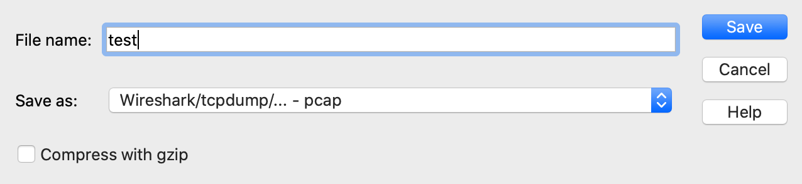

# Detecting and Preventing Security Threats

## Lab 1: Setting up docker

On your lab machine, run the following command to install docker.

```commandline
sudo apt install docker docker-compose
```

Add your user to the docker group

```commandline
sudo usermod -aG docker vcm
```

Log out and back into SSH.

Next, we'll clone the github repo to our VM.

```commandline
git clone https://github.com/amerck/colab_netsec.git
```

Change directories into the colab_netsec directory.

```commandline
cd colab_netsec
```

Test docker and docker-compose. You should see the following output:

```comandline
$ docker ps
CONTAINER ID   IMAGE     COMMAND   CREATED   STATUS    PORTS     NAMES
```

```commandline
docker-compose ps
         Name                       Command                State     Ports
--------------------------------------------------------------------------
```

## Lab 2: Running Suricata

Change directories into the 

Run the following command to run Suricata against the FTP pcap.

```commandline
export PCAP_NAME="ftp.pcap"; docker-compose up suricata
```

The export PCAP_NAME="ftp.pcap" line tells Suricata which pcap file to run against.

Examine the contents of the Suricata detection log.

```commandline
cat suricata_logs/fast.log
```

## Lab 3: Running Zeek

Run the following command to run Zeek against the Tomcat pcap.

```commandline
export PCAP_NAME="tomcat.pcap"; docker-compose up zeek
```

Explore the zeek_logs directory for interesting information.

```commandline
cd zeek_logs
cat http.log
cat conn.log
```

Compare this output to Wireshark.

# Lab 4: Run Suricata and Zeek against your own pcaps

Capture your own network traffic using Wireshark. Save the file to your 'pcaps' directory.

Be sure to save the output as 'pcap' format and not 'pcapng'.



Run Suricata and Zeek against this new file and examine the output.